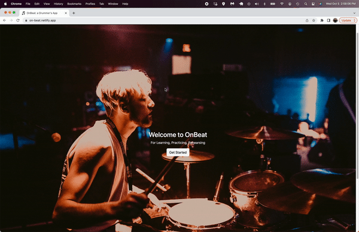

# OnBeat Drum App

[View Website](https://on-beat.netlify.app/)
### Overview
* The idea behind this project was to create an application for drummers to practice with, and potentially learn new ideas. There is an exercises page with 15 musical exercises, an individual exercise page that expands on a particular musical exercise and populates related YouTube videos. There is also a shopping-cart-like page where exercises of choice can be added from either the full exercises page, or from the individual exercise pages. The musical difficulty for the exercise content ranges from complete beginner to advanced player concepts in order to be enjoyed by a larger audience.

### Tech Stack
* React
* Redux
* Redux Persist
* YouTube API

### MVP (Minimum Viable Product)
* Create an app that displays readable sheet music
* Allows user to add and remove an exercise of their choice to the practice schedule
* Display related YouTube videos for each exercise for further learning
* Responsive and mobile-friendly design

### Stretch Goals Completed
* Creating all of my own data, including sheet music
* Embedding sheet music with playback feature instead of just using images of sheet music. If a change is made to the sheet music online, the webpage will also receive that change
* Formatting YouTube videos into an attractive bootstrap carousel
* Showing YouTube videos on the practice schedule page, as it was very challenging to get the data formatted and in the correct places 

### Future Stretch Goals
* Enhanced design
* Increasing the number of available API calls